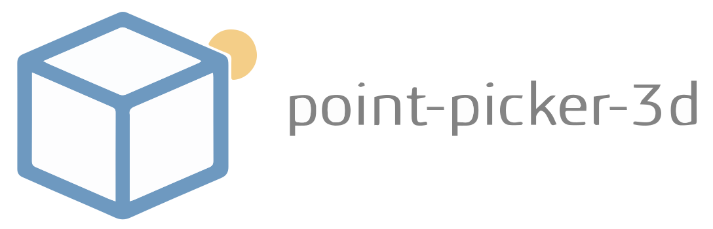
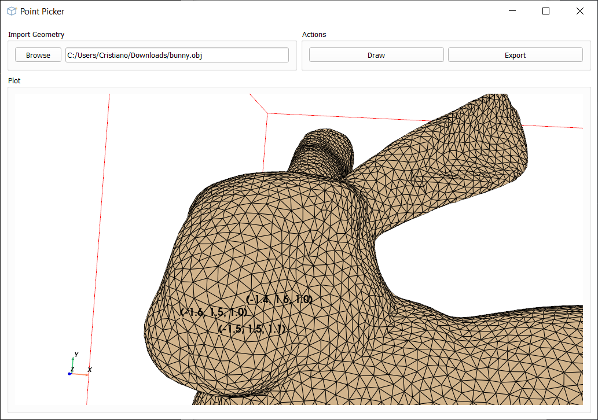

Introduction
------------

A simple interface to pick points on a geometry file (e.g. stl, ply, obj, etc.) and to export the coordinates to a csv file.

Changes from the original version:
- ply files have texture
- points are marked by a bigger red marker
- points are labeled by their index, and that label is always visible

Installation
------------

First, clone the repo. Then use:

.. code-block:: bash

   $ pip install -e .
   

Example Usage
-------------

Navigate to the `src/point_picker_3d` folder. Then use:

>>> python main.py

Mouse/keyboard operations:

* *Rotate*: left-click and drag
* *Pan*: hold the wheel down and drag
* *Zoom*: wheel
* *Pick a point*: press P or right click

